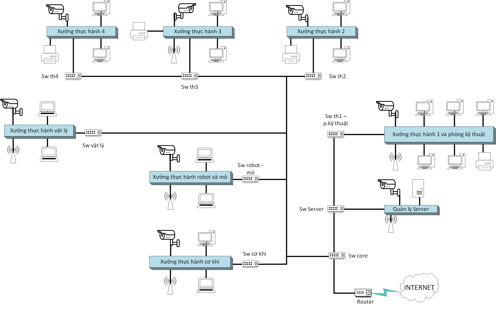
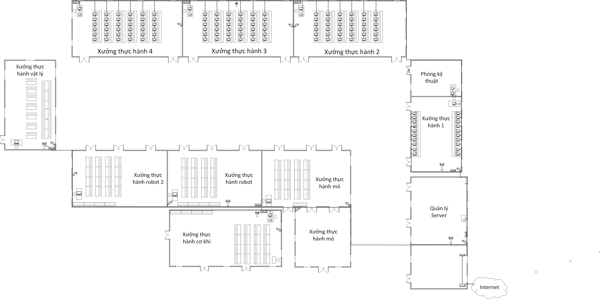
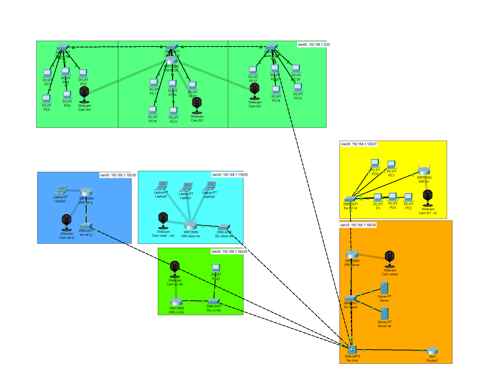

# Network Design for the Practical Workshop Area of Quang Ninh University of Industry

## Overview
This project focuses on designing and simulating a network system for the practical workshop area of Quang Ninh University of Industry. The goal is to provide a stable and organized network infrastructure to support teaching, research, and IoT experiments.

## Main Tasks
- Design network topology and logical diagrams  
- Configure VLANs and inter-VLAN routing  
- Set up network services: DHCP, DNS, HTTP/HTTPS, FTP, Email, and IoT services  
- Simulate and test the network environment  

## Tools
- Cisco Packet Tracer  
- Microsoft Visio  

## Note
This project was completed as a university group assignment.

## Logic Diagram

## Physical Diagram

## Simulator

